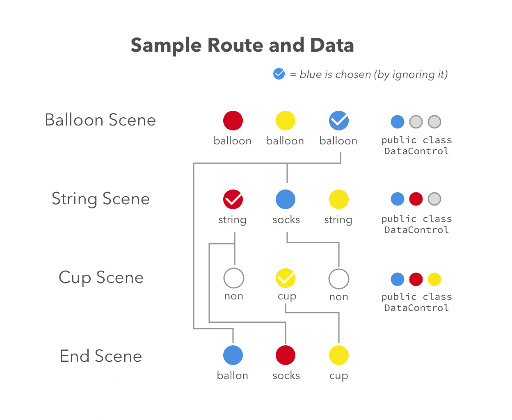

# Out of Control
A interactive film utilizing Tobii's eye-tracking technology

## Requirements
- Tobii eye tracker
- Tobii Core software
- Windows x64

## Technology In Use
- Unity
- Tobii SDK

## Core Features
### Video Blending - `BlendShader.shader`
There are two types of videos: background and objects. 

<!---->
Videos in each scene is multi-layered. _BlendShader.shader_ is to blend the background with particular objects into single video texture.
### Blur Effects - `Blur.shader`
Blur the video texture to mimic depth of filed effects.
### Colliders Animation - `class Enlarge, EnlargeString`
Since the objects is animated, the colliders of it must be animated as well.
### Dynamic Video Selection - `class DataControl, PlayerControl1D, PlayerControl2D`
To determine which object video should be played, a dynamic video selection is used. 

